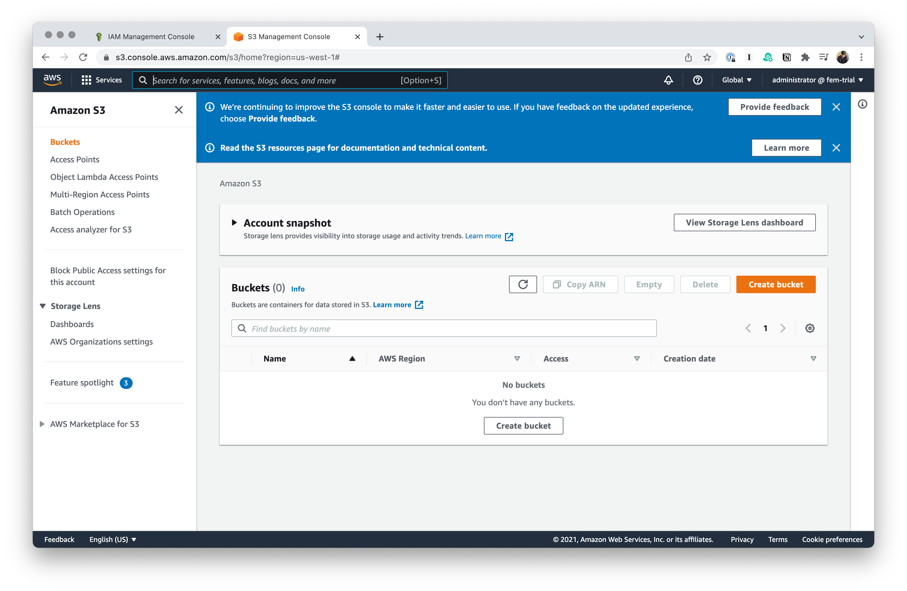
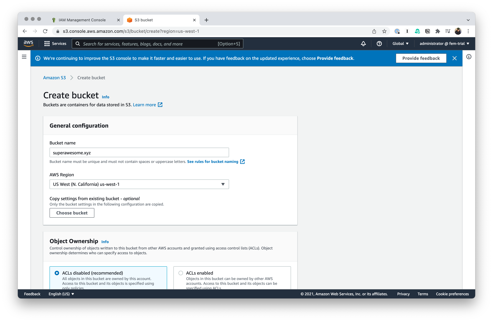
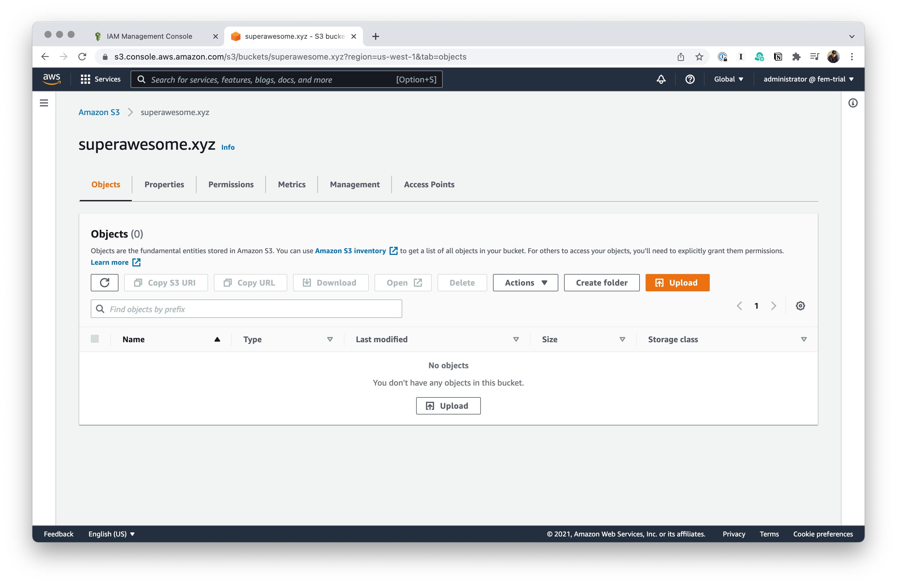
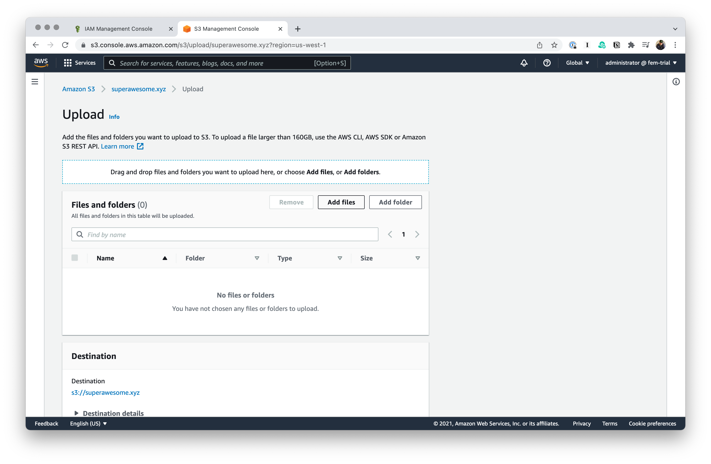
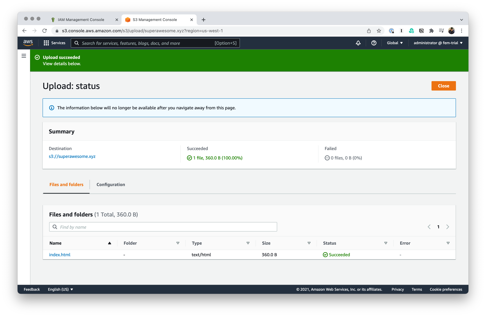
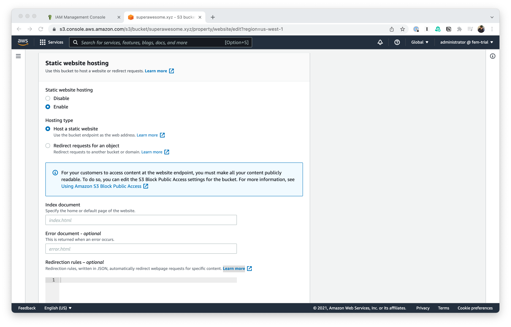
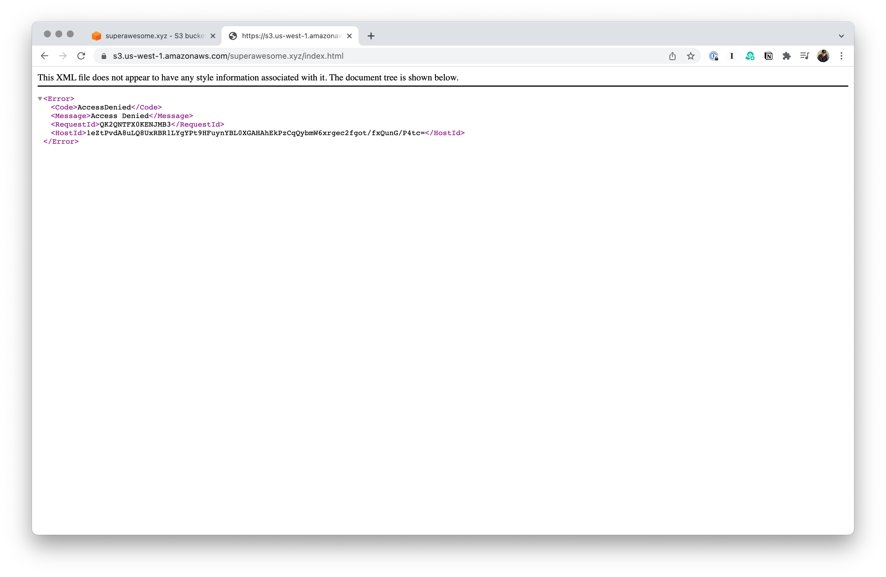
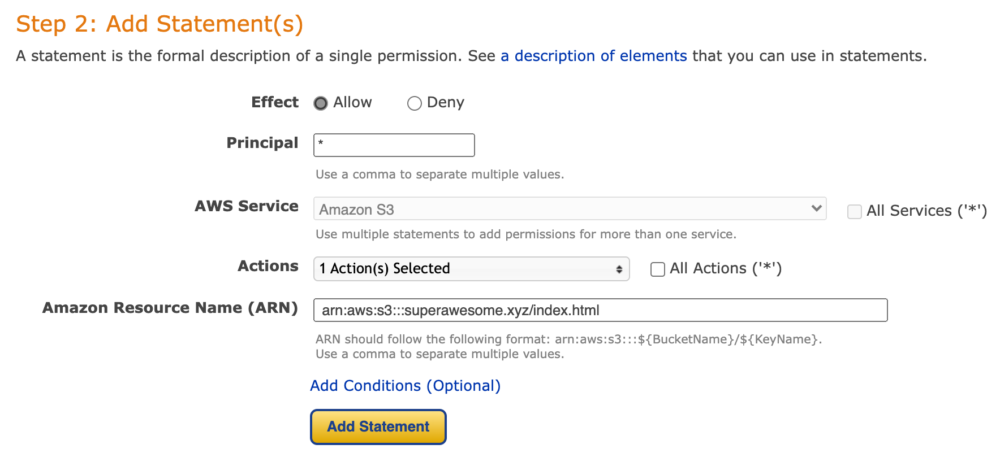
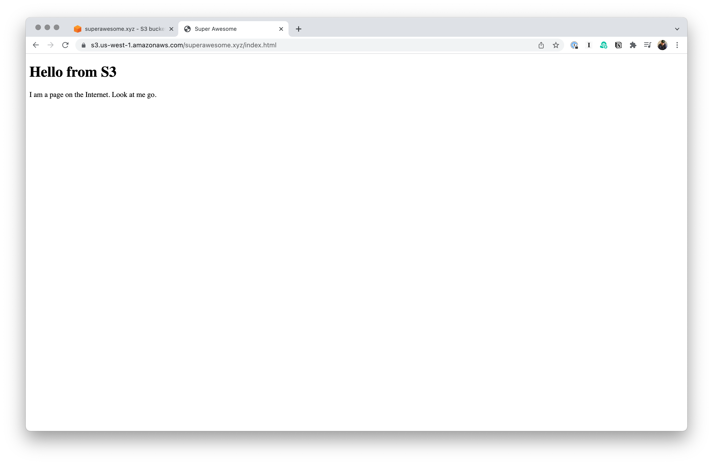

This is roughly what a policy looks like:

```json
{
  "Version": "2012-10-17",
  "Statement": [
    {
      "Effect": "Allow",
      "Principal": "*",
      "Action": "s3:GetObject",
      "Resource": "arn:aws:s3:::YOUR_BUCKET_NAME_HERE/*"
    }
  ]
}
```

- **Principal** — _who_ can do the thing?
- **Action** — _what_ can they do?
- **Resource** — to _which_ things?

Let’s upload our application.

- We’re going to set up an S3 bucket.
- We’re going to set a policy on the bucket.
- We’re going to configure the S3 bucket for static website hosting.
- We’re going to upload a simple React application via the command line.

## Making a bucket





Right now, we're going to stick with the defaults, but we're adjust some stuff in a little bit.

- Tags are basically metadata about a given resource in AWS. They are useful in a larger organization when you want to get a bit more granular with costs or figuring out who owns what.
- We don't need encryption, because we're looking to publicly server these assets.
- We don't want versioning because we'll be giving each of our file names a unique identifier anyway.
- We _are_ going to allow for public access to the bucket for obvious reasons, but we'll do that manually in a bit.




## Uploading a file to your bucket

Let's create a basic HTML file.

```html
<!DOCTYPE html>

<html lang="en">
  <head>
    <meta charset="UTF-8" />

    <meta http-equiv="X-UA-Compatible" content="IE=edge" />

    <meta name="viewport" content="width=device-width, initial-scale=1.0" />

    <title>Super Awesome</title>
  </head>

  <body>
    <h1>Hello from S3</h1>

    <p>I am a page on the Internet. Look at me go.</p>
  </body>
</html>
```

Uploading via the UI is fairly straightforward.





## Setting permissions

Let's head over the **Properties** tab and if you scroll all the way to the bottom, you'll see a fun section called **Static website hosting**. You can take a lucky as to what we'll be able to do there.



- Those look like defaults in the input fields for **Index document** and **Error document**, but you actually have to fill them in.
- We didn't make an `error.html` just yet—but we should make a mental note to do that.

%%**TODO**: Decide if you want to cover **Redirection rules**.%%

We're not totally out of the woods yet. We can go to the file in the bucket and we can copy the URL, but this is going to be what we're going to see.



### Using the AWS Policy Generator

One option is to use the very fancy [AWS Policy Generator](https://awspolicygen.s3.amazonaws.com/policygen.html).



You can't see it in the picture, we we chose `GetObject` as the action that we wanted allowed. This is what comes out the other end.

```json
{
  "Id": "Policy1639258236278",
  "Version": "2012-10-17",
  "Statement": [
    {
      "Sid": "Stmt1639257998924",
      "Action": ["s3:GetObject"],
      "Effect": "Allow",
      "Resource": "arn:aws:s3:::superawesome.xyz",
      "Principal": "*"
    }
  ]
}
```

## Using the interactive editor

- In **Add actions**, choose S3.
- Then, select **GetObject** by filtering the actions.
- In **Add a resource**, you can specify particular file names or just everything in the bucket using a wild card.
  - Selecting **All resources** will actually generate an error in this case.
  - Instead, enter `"arn:aws:s3:::${BucketName}/*"`, where `${BucketName}` is whatever you named your bucket.

The end result should look something like this:

```json
{
  "Version": "2012-10-17",
  "Statement": [
    {
      "Sid": "PublicRead",
      "Effect": "Allow",
      "Principal": "*",
      "Action": ["s3:GetObject", "s3:GetObjectVersion"],
      "Resource": ["arn:aws:s3:::superawesome.xyz/*"]
    }
  ]
}
```

Hmm, so now I'm greated with this error.


It's complaining that I don't have permissions to `s3:PutBucketPolicy`. Let's figure this out.

Here is the thing: That error message is kind of right, but mostly wrong. If you go spelunking in your administrator permissions, you'll see that you _do_ have access? So, what gives?

Copy your policy to the clipboard, we'll try again shorty, but for let's go back and take a look at that **Block public access** section that we've been conveniently ignoring.

This is what's denying us access to change the policy around this—despite what the previous error message says.

Let's turn this off. Now if you go back, and apply your policy again, it should stick.



This works, but there are still some problems that we're going to have to deal with.

- The URL isn’t great.
- Doing this manually can get tedious.
- It’s hosted in Oregon. (No offense to Oregon.)
- Routing is kind of breaking the web.
